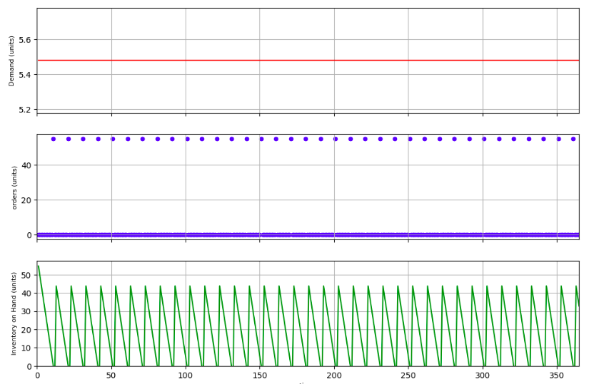
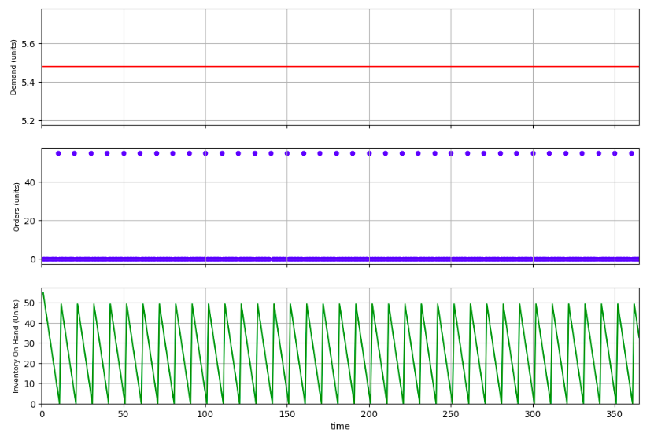
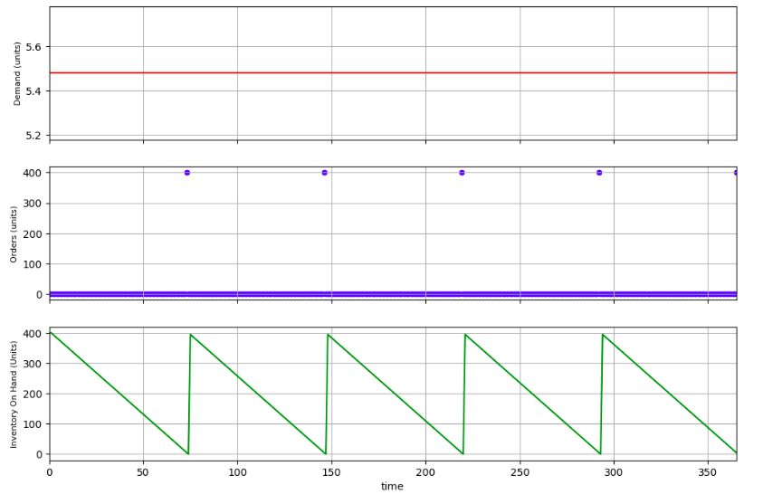
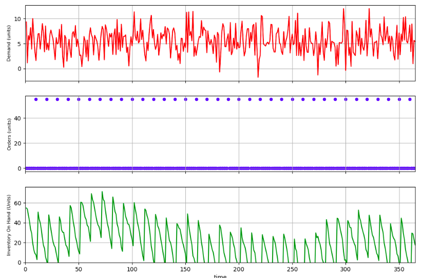

# Deterministic Inventory Models

Inventory simulation for people who like seeing what happens before it happens.

---

## Overview

A deterministic inventory simulation toolkit. Models how different ordering policies and lead times affect inventory levels over time. Code in modules, visuals in notebooks.

## The Setup

- Demand is constant (boring but predictable)
- Orders go out every T days
- Receipts show up after LD days
- Negative inventory = stockout (we keep it simple)

## Key Parameters

- `D`: annual demand (units/year)
- `T_total`: number of days in the simulation horizon
- `D_day`: daily demand (`D` divided by `T_total`)
- `T`: cycle length in days (spacing between order placements)
- `Q`: order quantity (often `D_day × T` in the baseline)
- `LD`: lead time in days (order → receipt)
- `initial_ioh`: starting inventory on hand

## Scenarios

## Scenario 1,2,3: 
* Visual Representation Specifically for scenario 1*


**1. LD = 1 day** — Smooth sawtooth. Inventory hits zero, receipt arrives next day. No drama.

**2. LD = 2 days** — Same policy, longer wait. Inventory goes negative. Timing is the problem.

**3. LD = 2, bigger Q** — Order more to cover the gap. Fixes stockouts, but average inventory climbs. Treats symptom, not cause.


## Scenario 4: 
* Visual Representation *
**4. LD = 2, order earlier** — Order when inventory hits ROP = D_day × LD. Clean sawtooth returns. No excess, no stockouts.



## Scenario 5: 
* Visual Representation *
**5. EOQ, LD = 1** — Classic formula. Minimizes ordering + holding cost. Average inventory sits at Q*/2.




## Scenario 6: 
* Visual Representation *
**6. Stochastic demand, LD = 5** — Demand varies. Fixed cycle alone won't cut it. Safety stock enters the chat.



## Getting Started

```bash
git clone https://github.com/KrrishKoulia/Deterministic-Inventory-Models.git
cd Deterministic-Inventory-Models
pip install -r requirements.txt
jupyter notebook notebooks/inventory_analysis.ipynb
